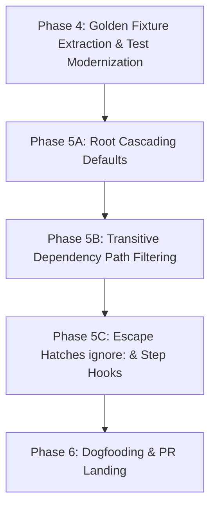

# `pkg:mono_repo` Reboot Master Plan (`future` branch)

> [!IMPORTANT]
> This document is the single **Source of Truth** for the `pkg:mono_repo` reboot. It incorporates all locked-in architectural decisions, monorepo ecosystem research, Dart 3.5+ Workspace support, and the step-by-step implementation roadmap for landing PR #519.

---

## 1. Executive Summary & Architectural Pillars

The `future` reboot transforms `pkg:mono_repo` from a legacy Travis-CI-era job-merging tool into a modern, zero-config CI workflow generator for Dart & Flutter monorepos:

1. **One Workflow Per Package**: Generates `.github/workflows/<package_name>.yaml` for every package instead of a single monolithic `dart.yml`.
2. **Root Cascading Defaults (`defaults:`)**:
   - Define default stages, SDK targets, and OS runners once in root `mono_repo.yaml` (e.g. `defaults: sdk: [pubspec, dev]`, `stages: [analyze_and_format, test]`).
   - Subpackages inherit these defaults automatically. **Subpackages require zero `mono_pkg.yaml` files** unless they need custom overrides.
3. **One-Layer Deep Stage Merging**:
   - Subpackages overriding `mono_pkg.yaml` overwrite top-level keys (`sdk`, `os`, `stages`). No complex deep child-item merging within a stage.
4. **Transitive Path Filtering**:
   - Automatically computes internal package dependencies. If `pkg_c` depends on `pkg_b`, `.github/workflows/pkg_c.yaml` includes `pkgs/pkg_c/**`, `pkgs/pkg_b/**`, AND root `pubspec.yaml` under `paths:`.
   - `mono_repo.yaml` is excluded from per-package workflows and included in `mono_repo_self_validate.yaml`.
5. **Dart Workspaces Auto-Detection**:
   - Auto-detects packages listed under `workspace:` in root `pubspec.yaml`.
   - Emits uniform `working-directory: <pkg_dir>` for `dart pub upgrade` steps across all packages.
6. **Pragmatic Escape Hatches (`ignore: [...]`)**:
   - Packages with hand-rolled CI (e.g. Docker emulators or Google Cloud Build steps) are listed under `ignore:` in `mono_repo.yaml`.
   - Custom step hooks (`pre_steps:`, `post_steps:`) allow injecting setup/teardown steps into generated jobs.
7. **No Cross-Package Job Merging**: Strips out legacy Travis-CI-era `groupCIJobEntries` and `merge_stages` algorithms.

---

## 2. Status Audit of `future` Branch

| Component | Status | Source Location | Notes |
| :--- | :---: | :--- | :--- |
| **Per-Package Workflow Generator** | ✅ Complete | [github_yaml.dart](file:///usr/local/google/home/kevmoo/github/mono_repo.dart/mono_repo/lib/src/commands/github/github_yaml.dart#L156-L167) | Generates `.github/workflows/<pkg>.yaml` |
| **Self-Validate Workflow** | ✅ Complete | [github_yaml.dart](file:///usr/local/google/home/kevmoo/github/mono_repo.dart/mono_repo/lib/src/commands/github/github_yaml.dart#L169-L173) | Generates `mono_repo_self_validate.yaml` |
| **SDK Inference** | ✅ Complete | [package_config.dart](file:///usr/local/google/home/kevmoo/github/mono_repo.dart/mono_repo/lib/src/package_config.dart) | Infers `oldest`, `newest`, `pubspec` versions |
| **Legacy Code Removal** | ✅ Complete | `mono_config.dart`, `yaml.dart` | Removed `merge_stages` and legacy job merging |
| **Unit Tests Passing** | ✅ Complete | `mono_repo/test/` | All 45 unit tests pass cleanly |
| **Golden Fixture Refactoring** | 🟡 Phase 4 | `mono_repo/test/` | Extract string constants into `.yaml` golden files |
| **Root Cascading Defaults** | ✅ Phase 5A | `root_config.dart` & `mono_config.dart` | Cascade `defaults:` down to packages missing `mono_pkg.yaml` |
| **Transitive Path Filtering** | 🟡 Phase 5B | `github_yaml.dart` | Compute transitive internal package paths |
| **Escape Hatches (`ignore: [...]`)** | 🟡 Phase 5C | `mono_config.dart` | Skip workflow codegen for ignored packages |

---

## 3. Step-by-Step Implementation Roadmap



### Phase 4: Golden Fixture Extraction & Test Modernization
- **Goal**: Refactor `mono_repo/test/src/expected_output.dart` by extracting inline string constants into dedicated, diffable `.yaml` golden files under `test/script_integration_outputs/`.
- **Target Files**:
  - `mono_repo/test/src/expected_output.dart`
  - `mono_repo/test/generate_test.dart`
  - `mono_repo/test/shared.dart`

### Phase 5A: Root Cascading Defaults Implementation
- **Goal**: Allow `mono_repo.yaml` to define global `defaults:`. If a subpackage lacks a `mono_pkg.yaml`, automatically synthesize its configuration using root defaults and `pubspec.yaml` SDK inferencing.
- **Target Files**:
  - `mono_repo/lib/src/mono_config.dart`
  - `mono_repo/lib/src/package_config.dart`
  - `mono_repo/lib/src/root_config.dart`

### Phase 5B: Transitive Dependency Path Filtering
- **Goal**: Calculate internal package dependency graph in `github_yaml.dart`. Append all transitive internal dependency directory paths and root `pubspec.yaml` to each package's `paths:` trigger list.
- **Target Files**:
  - `mono_repo/lib/src/commands/github/github_yaml.dart`
  - `mono_repo/lib/src/root_config.dart`

### Phase 5C: Escape Hatches (`ignore: [...]` & Step Hooks)
- **Goal**: Add `ignore:` array parsing in `mono_config.dart` to skip workflow generation for ignored packages. Add support for `pre_steps:` and `post_steps:` in `package_config.dart`.
- **Target Files**:
  - `mono_repo/lib/src/mono_config.dart`
  - `mono_repo/lib/src/commands/github/github_yaml.dart`

### Phase 6: Dogfooding, Self-Generation & PR Landing
- **Goal**: Run `mono_repo generate` on `pkg:mono_repo` itself. Verify generated `.github/workflows/mono_repo.yaml` and `mono_repo_self_validate.yaml`. Run full test suite (`dart test`) and prepare PR #519.

---

## 4. Verification Protocol

```bash
# 1. Run full unit & integration test suite
cd /usr/local/google/home/kevmoo/github/mono_repo.dart/mono_repo
PATH="$HOME/github/flutter/bin:$PATH" ~/github/flutter/bin/dart test

# 2. Test self-generation on pkg:mono_repo
cd /usr/local/google/home/kevmoo/github/mono_repo.dart
PATH="$HOME/github/flutter/bin:$PATH" ~/github/flutter/bin/dart run mono_repo generate
git status
```
